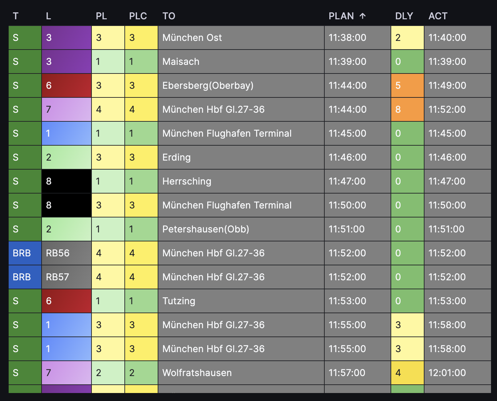

# Deutsche Bahn Timetables Prometheus Exporter

**An application that fetches Deutsche Bahn train timetable data and exposes Prometheus metrics for one current station close to your office :)**



## How to run it locally

1. **Clone the repository:**

    ```bash
    git clone https://github.com/BestianCode/deutschebahn.timetable.prometheus.exporter
    cd deutschebahn.timetable.prometheus.exporter
    ```

2. **Create a virtual environment:**

    ```bash
    python3 -m venv .env
    source .env/bin/activate
    ```

3. **Install dependencies:**

    ```bash
    pip install -r requirements.txt
    ```

4. **Set environment Variables:**

    ```bash
    # Deutsche Bahn API Client ID
    export DB_CLIENT_ID="your_client_id"

    # Deutsche Bahn API Client Secret
    export DB_CLIENT_SECRET="your_client_secret"

    # Number of minutes to keep train data (default is 30)
    export KEEP_MINUTES=30

    # EVA station number
    export DB_STATION="8004128" # Donnersbergerbrücke
    # export DB_STATION="8011160" # Berlin Hbf
    # Full list of the codes can be found in `UIC-Bahnhofsnummer.csv` file.
    ```

5. **Run the application:**

    ```bash
    python main.py
    ```

6. **Access the metrics:**

    Open your browser or use `curl` to acces:
    - `http://localhost:8080/metrics` to get data in Prometheus format
    - `http://localhost:8080/json` to get data in pure json format

    ```bash
    curl http://localhost:8080/metrics
    curl http://localhost:8080/json
    ```

7. **Deply Helm Chart:**

    ```bash
    helm upgrade --install db-exporter helmchart/deutschebahn/ --namespace db-exporter --create-namespace --values ./my-values.yaml
    ```

## Endpoints

### `/json`

Exposes pure json metrics based on the latest train timetable data.

- **URL:** `http://localhost:8080/json`

### `/metrics`

Exposes Prometheus metrics based on the latest train timetable data.

- **URL:** `http://localhost:8080/metrics`
- **Method:** `GET`
- **Response:** `text/plain` containing Prometheus metrics.

## Metrics

The application provides the following Prometheus metrics:

- `train_planned_departure_unixtime_seconds`: Planned departure time as a Unix timestamp.
- `train_actual_departure_unixtime_seconds`: Actual departure time as a Unix timestamp.
- `train_delay_minutes`: Delay in minutes.
- `train_planned_departure_platform`: Planned departure platform number.
- `train_actual_departure_platform`: Actual departure platform number.
- `train_departure_event_status`: Event status for departure (mapped to numerical codes).
- `train_delay_source`: Source of delay information (mapped to numerical codes).

### Example Metrics Output

```
# HELP train_planned_departure_unixtime_seconds Planned departure time as a Unix timestamp
# TYPE train_planned_departure_unixtime_seconds gauge
train_planned_departure_unixtime_seconds{train_id="ICE_1234__p",train_type="ICE",train_number="1234",line="3",destination="Frankfurt"} 1704061800
# HELP train_actual_departure_unixtime_seconds Actual departure time as a Unix timestamp
# TYPE train_actual_departure_unixtime_seconds gauge
train_actual_departure_unixtime_seconds{train_id="ICE_1234__p",train_type="ICE",train_number="1234",line="3",destination="Frankfurt"} 1704062100
# HELP train_delay_minutes Delay in minutes
# TYPE train_delay_minutes gauge
train_delay_minutes{train_id="ICE_1234__p",train_type="ICE",train_number="1234",line="3",destination="Frankfurt"} 5
...
```

## Usage

This exporter is designed to be used as a base image in Helm charts or other Kubernetes deployments to expose Prometheus metrics for files in a directory.

## Kubernetes Deployment annotations

```yaml
    annotations:
        prometheus.io/path: /metrics
        prometheus.io/port: 8080
        prometheus.io/scrape: "true"
```

## License

This project is licensed under BSD 2-Clause License.

## URLs

- **Prometheus Exporter's HelmChart and Dockerfile**: https://github.com/BestianCode/deutschebahn.timetable.prometheus.exporter
- **Prometheus Exporter's Docker Image**: https://hub.docker.com/repository/docker/bestian/deutschebahn.timetable.prometheus.exporter/general
- **Grafana DashBoard**: https://grafana.com/grafana/dashboards/22489-deutsche-bahn-live-departures/ or [DB Departures JSON File](https://github.com/BestianCode/deutschebahn.timetable.prometheus.exporter/tree/master/grafana)
